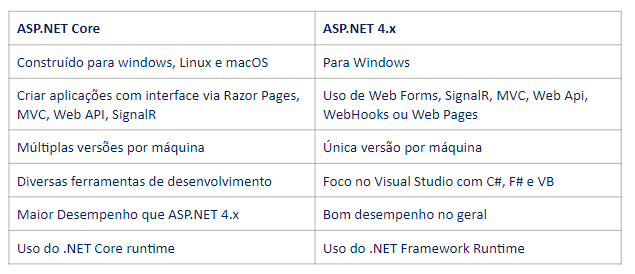

# Introdução ao pensamento computacional :man_scientist:

- ####  :spiral_notepad: Link notion: 

  - [Resumo 1](https://showy-secure-60e.notion.site/Ecossistema-Net-e-Documenta-o-a1d76d33fdb84b288e55a9dd79068c55)

- ####  :computer: Minhas redes:

  - [GitHub](https://github.com/Brennez)

  - [Linkedin](https://www.linkedin.com/in/tchalisson-brenne-27911421b/)

- ####  :paperclips: Resumo: 

  - Slides das aulas

    1. Apresentação  → ([Apresentacao do Expert.pptx - Apresentações Google](https://docs.google.com/presentation/d/17_so96uxqkX2o_D9_6TzSUvP6aTvXlOf/edit#slide=id.p2))
    2. Slide aula 01    →  ([Curso Introdução ao Ecossistema .NET - Aula 1.pptx - Apresentações Google](https://docs.google.com/presentation/d/1CxUS5QHCu4mqMiCoMqbMpGjUntIlpYSc/edit#slide=id.p5))
    3. Slide aula 02    → ([Curso Introdução ao Ecossistema .NET - Aula 2.pptx - Apresentações Google](https://docs.google.com/presentation/d/1FvIKgAR2AAA5q6CWxiUYCRt3UI88OqMP/edit#slide=id.p5))
    4. Slide aula 03 → [Curso Introdução ao Ecossistema .NET - Aula 3.pptx - Apresentações Google](https://docs.google.com/presentation/d/1Vhee732MMbZIELQEWDx1CSwVyNinyYN1/edit#slide=id.p5)
    5. Slide aula 04 - ([Curso Introdução ao Ecossistema .NET - Aula 4.pptx - Apresentações Google](https://docs.google.com/presentation/d/1f99uXpF7vx12B1-RXewflQ_kZzc32mk-/edit#slide=id.p5))
    6. Slide aula 05 - ([Curso Introdução ao Ecossistema .NET - Aula 5.pptx - Apresentações Google](https://docs.google.com/presentation/d/16n61iXir2ywb-DW72H_Zjr7raqOjw_Ia/edit#slide=id.p5))
    
    - Resumo aula 05
    
      - O que usar? Quando usar?
      
        - .Net core x .Net framework → O que usar para cada tipo de aplicação?
      
      - Usar .Net quando:
      
        - Plataforma cruzada
        - Utilize microsserviços
        - Use Docker
        - Alto desempenho e sistemas escalonáveis
        - Necessidade de versões .NET diferentes
      
      - Usar .Net framework quando:
      
        - Não precisa migrar para .NET
        - Bibliotecas e pacotes que não estão disponíveis para .NET
        - Quando o projeto não suporta determinada linguagem, como Visual Basic ou F#
      
    - Comparação:
      
      
