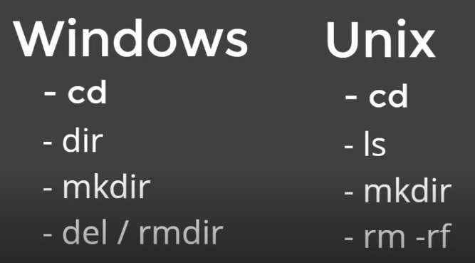
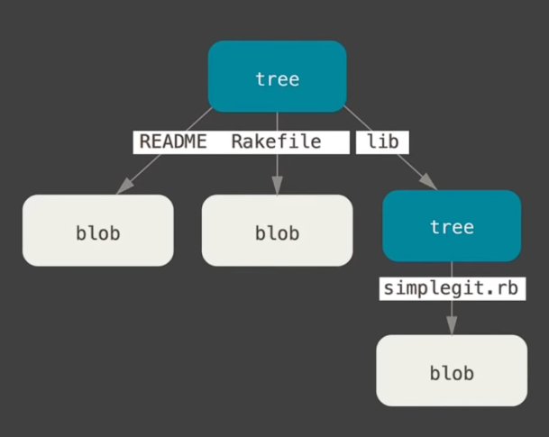
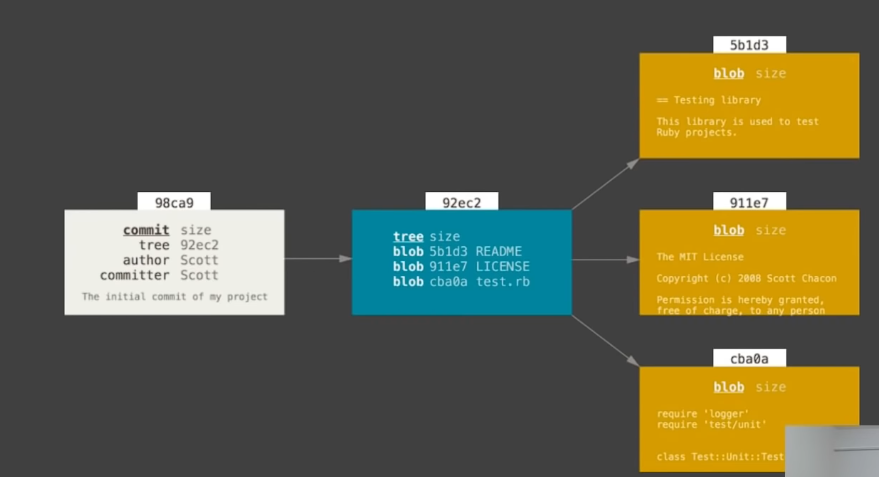
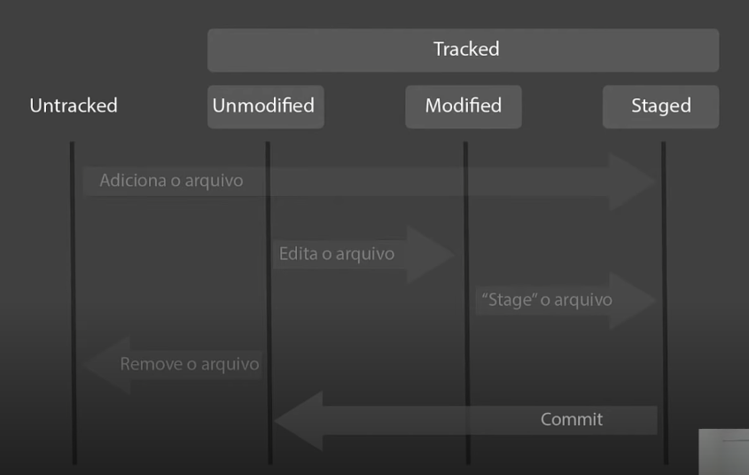

# Introdução ao pensamento computacional :man_scientist:

- ####  :spiral_notepad: Link notion: 

  - [Resumo 3](https://showy-secure-60e.notion.site/Git-e-Github-M-dulo-c5f79a0c4a5a4afda0ab98a72172d699)

- ####  :computer: Minhas redes:

  - [GitHub](https://github.com/Brennez)

  - [Linkedin](https://www.linkedin.com/in/tchalisson-brenne-27911421b/)

- ####  :paperclips: Resumo: 

  - # Git e Github - Resumo

    - Comandos básicos do terminal

      - GUI X LCI

        - GUI → Graphic User Interface
        - CLI → Comand Line Interface
  
      - Comandos básicos de terminal Windows x Linux
  
        
  
    - Objetos do Git
  
      - Blob
  
        - Armazena metadados do git
        - Armazena o tamanho do arquivo
        - Vai ter um \0
        - Armazena o conteúdo do arquivo

      - Tree

        - Armazena metadados

        - Armazena blobs

        - vai ter um \0
  
        - armazena blobs que por sua vez possui um sha1
  
        - vai armazenar o nome do arquivo
  
          - ⚠️NOTE: Os blobs não armazenam o nome do arquivo apenas o seu conteúdo
  
        - As trees podem armazenar outras trees, montando assim toda a estrutura de arquivos, por isso, ela possui essa característica recursiva, pois pode haver trees que apontam para outras trees
  
        - ✅ EXEMPLO DE FUNCIONAMENTO:
  
          
  
      - Commits
  
        - Apontam para trees que possuem um sha1 associada a ela
        - Aponta para um parente, ou seja, um commit anterior ao que está sendo feito neste momento
        - Aponta para um autor (pessoa que escreveu a mudança)
        - Aponta para uma mensagem (”this is my first commit”)
        - timestamp
  
      - ‼️ Lógica de funcionamento desse sistema:
  
        - Lembre-se que blobs, trees e commits possuem um sha1 associados a eles, ou seja, quando uma mudança é feita em um arquivo ele gera um sha1 diferente, se outra mudança é feita, outro sha1 é gerado, associado a última mudança feita. Neste contexto, quando uma blob é modificada, um novo sha1 é gerado, agora lembre-se que uma tree aponta para uma blob, então se a blob mudou então a tree também vai mudar, lembre-se, uma tree também possui um sha1 associada a ela, logo, se a árvore muda um novo sha1 é gerado, em seguida se a árvore mudou, o commit também irá mudar, pois commits apontam para árvores, logo se um commit mudou, também será gerado um novo sha1. Sabendo disso podemos perceber o efeito cascata, onde uma pequena mudança feita em blob se propaga para toda a estrutura de arquivos.
  
        - ✅EXEMPLO:
  
          
  
    - Ciclo de vida de um arquivo git
  
      - Repositório remoto:
  
        - ✅ REPRESENTAÇÃO:
  
          
  
        - Untracked
  
          - Representa aqueles arquivos que o git ainda não tem conhecimento deles, ou seja, eu criei um arquivo, no entanto, não existe nada ainda no meu arquivo. Nesse cenário o meu arquivo está untracked, sempre ocorre antes de eu rodar um git add.
  
        - Unmodified
  
          - Ocorre depois do git add, o git já tem ciência da existência deste arquivo, no entanto, ele ainda não tem nenhuma modificação, portanto ele está unmodified.
  
        - Modified
  
          - Ocorre automaticamente após eu modificar qualquer coisa no meu arquivo, nesse ponto não precisa rodar nenhum comando para ele pular de um estado para outro, o git detecta a modificação automaticamente comparando o sha1 dos arquivos para detectar as modificações.
  
        - Estaged
  
          - Quando rodamos um git add novamente em um arquivo modified ele fica em uma espécie de área especial aguardando novas instruções, essa área especial em que o arquivo fica é chamada de Estaged. Ou seja o arquivo foi modificado, porém agora ele aguarda no estaged pra poder fazer parte de um commit.
  
        - ⚠️IMPORTANTE: Quando você roda um commit o arquivo volta a ser unmodified, quando modifica algo ele vai pra modified, e em seguida pro estaged, se rodar um commit ele volta pra unmodified. Formando uma espécie de ciclo.
