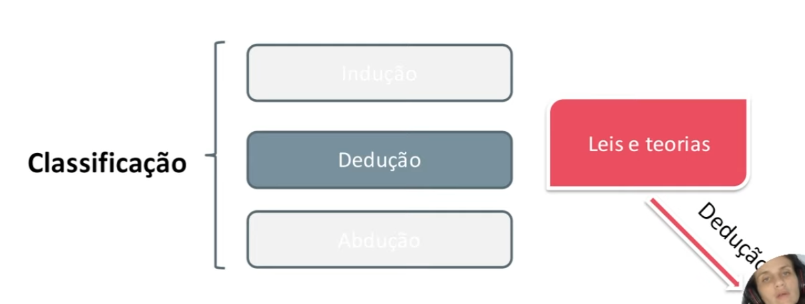

# Introdução ao pensamento computacional :man_scientist:

- ####  :spiral_notepad: Link notion: 

  - [Resumo 2](https://showy-secure-60e.notion.site/Introdu-o-Racioc-nio-l-gico-ea94b0d0a1ba4321a28ee42b8ead7bbb)

- ####  :computer: Minhas redes:

  - [GitHub](https://github.com/Brennez)

  - [Linkedin](https://www.linkedin.com/in/tchalisson-brenne-27911421b/)

- ####  :paperclips: Resumo: 

  
